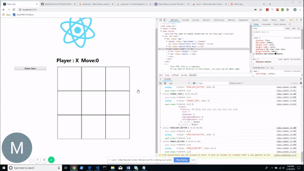

## Overview of TicTacToe tutorial with React, TypeScript, Jest, and Redux.

## Main Goal of doing this tutorial:

- Gaining a grasp of Redux
- Deeper learning on Jest & TypeScript
- As well on the last two implementations of this TicTacToe tutorial  
I've been struggling with managing state in my react applications.  
This implementation will avert previous issues I was having when  
many setState calls happen at once.
- A better understand of Jest with Enzyme
- A better understanding of TypeScript 

## Technology Stack:

- React
- TypeScript
- Redux
- Jest
- Enzyme 
- EcmaScript 2016
- GIT (for source control)

## Demonstration of TicTacToe app

## Other technologies 

- [Loom](https://chrome.google.com/webstore/detail/loom-video-recorder-scree/liecbddmkiiihnedobmlmillhodjkdmb?hl=en)
- I used [EZGIF.COM](https://ezgif.com/video-to-gif) for converting Loom video into gif

## How to use app?

- git clone https://github.com/MarkSchemmer/TicTacToe-With-React-TypeScript-Redux-Jest.git
- open command line, "cd tictactoe"
- "npm i"
- "npm start" 
- presto! You might have to install node 
